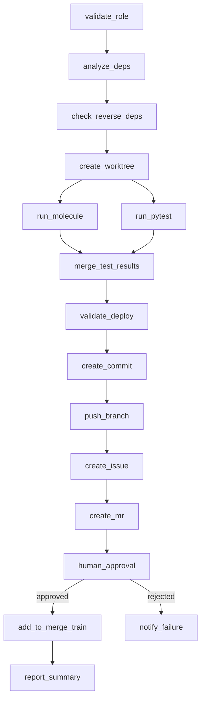

# DAG Harness - Comprehensive LLM Documentation

This document provides detailed information for LLMs interacting with DAG Harness.

## Installation

### Quick Install (Recommended)

```bash
curl -sSL https://raw.githubusercontent.com/Jesssullivan/Ansible-DAG-Harness/main/scripts/bootstrap.sh | bash
```

### Via uv (from GitHub)

```bash
# Specific version
uv tool install git+https://github.com/Jesssullivan/Ansible-DAG-Harness.git@main

# Latest from main
uv tool install git+https://github.com/Jesssullivan/Ansible-DAG-Harness.git
```

### Via pip (from GitHub)

```bash
# Specific version
pip install git+https://github.com/Jesssullivan/Ansible-DAG-Harness.git@main

# Direct wheel URL (fastest)
pip install https://github.com/Jesssullivan/Ansible-DAG-Harness/releases/download/latest/dag_harness-latest-py3-none-any.whl
```

### From Source

```bash
git clone https://github.com/Jesssullivan/Ansible-DAG-Harness.git
cd dag-harness/harness
uv sync  # or: pip install -e .
```

### Post-Installation

```bash
harness bootstrap           # Interactive setup
harness bootstrap --check-only  # Verify installation
```

## System Overview

DAG Harness is a **self-installing orchestration system** for managing Ansible role deployments through a structured workflow. Built on:

- **LangGraph 1.0.x** - Workflow execution with checkpointing
- **FastMCP** - Model Context Protocol server (40+ tools)
- **SQLite** - State persistence with PostgreSQL option
- **GitLab API** - Issue/MR/merge train integration

## Architecture

```
┌─────────────────────────────────────────────────────────────┐
│                    Claude Code / MCP Client                 │
├─────────────────────────────────────────────────────────────┤
│                        MCP Server                           │
│              (40+ tools across 8 categories)                │
├─────────────────────────────────────────────────────────────┤
│    CLI (Typer)    │   LangGraph DAG   │   HOTL Supervisor   │
├───────────────────┼───────────────────┼─────────────────────┤
│                      StateDB (SQLite)                       │
├─────────────────────────────────────────────────────────────┤
│   GitLab API   │   Git Worktrees   │   Molecule/Pytest     │
└─────────────────────────────────────────────────────────────┘
```

## Workflow DAG (17 nodes)



### Node Details

| Node | Purpose | Retry |
|------|---------|-------|
| validate_role | Verify role exists, check molecule/meta | - |
| analyze_deps | Query StateDB for dependencies | - |
| check_reverse_deps | Ensure reverse deps processed first | - |
| create_worktree | Create isolated git worktree | - |
| run_molecule | Execute Ansible Molecule tests | 2x timeout |
| run_pytest | Execute Python tests | 2x timeout |
| validate_deploy | Run ansible-playbook --syntax-check | - |
| create_commit | Stage and commit changes | - |
| push_branch | Push to origin | 3x exponential |
| create_issue | Get-or-create GitLab issue | 3x exponential |
| create_mr | Get-or-create GitLab MR | 3x exponential |
| human_approval | HITL interrupt() for approval | - |
| add_to_merge_train | Add MR to merge train | 3x exponential |
| report_summary | Generate final summary | - |

## MCP Tool Reference

### role_management (7 tools)

| Tool | Parameters | Returns |
|------|------------|---------|
| `list_roles` | wave?: int | Role[] |
| `get_role_status` | role_name: str | RoleStatus |
| `get_dependencies` | role: str, transitive?: bool | str[] |
| `get_reverse_dependencies` | role: str, transitive?: bool | str[] |
| `get_deployment_order` | - | str[] |
| `get_dependency_graph` | - | [str, str][] |
| `sync_roles_from_filesystem` | - | SyncResult |

### workflow (5 tools)

| Tool | Parameters | Returns |
|------|------------|---------|
| `get_workflow_status` | execution_id: int | WorkflowStatus |
| `hotl_status` | - | HOTLStatus |
| `hotl_cancel_executions` | - | int |
| `hotl_get_recent_executions` | limit?: int | Execution[] |
| `hotl_get_health` | - | HealthReport |

### agent (6 tools)

| Tool | Parameters | Returns |
|------|------------|---------|
| `agent_report_progress` | session_id: str, progress: str | None |
| `agent_request_intervention` | session_id: str, reason: str | None |
| `agent_log_file_operation` | session_id: str, file_path: str, operation: str, diff?: str | None |
| `agent_get_session_context` | session_id: str | SessionContext |
| `agent_list_sessions` | status?: str | Session[] |
| `agent_get_file_changes` | session_id: str | FileChange[] |

### costs (3 tools)

| Tool | Parameters | Returns |
|------|------------|---------|
| `track_token_usage` | session_id: str, model: str, input_tokens: int, output_tokens: int | None |
| `get_session_costs` | session_id: str | CostBreakdown |
| `get_cost_summary` | start_date?: str, end_date?: str | CostSummary |

## CLI Usage Patterns

### Typical Workflow

```bash
# 1. Bootstrap (first time)
harness bootstrap

# 2. Sync roles from filesystem
harness sync --roles

# 3. Check role status
harness status common

# 4. Execute workflow
harness box-up-role common

# 5. Resume if paused at human gate
harness resume 123 --approve
```

### HOTL Mode

```bash
# Start autonomous operation
harness hotl start --max-iterations 10

# Monitor
harness hotl status

# Stop
harness hotl stop
```

### Debugging

```bash
# Check system health
harness check --schema --data --graph

# View workflow graph
harness graph --format mermaid

# Database stats
harness db stats

# Cost tracking
harness costs report --days 7
```

## Configuration

### harness.yml

```yaml
db_path: harness/harness.db
repo_root: /path/to/ansible/roles/parent

gitlab:
  project_path: group/subgroup/project
  group_path: group
  default_assignee: username
  default_labels: [role, ansible]
  default_iteration: "Sprint 1"

worktree:
  base_path: /path/to/worktrees
  branch_prefix: feature/

testing:
  molecule_required: true
  pytest_required: false
  deploy_target: inventory_host
  molecule_timeout: 600
  pytest_timeout: 300

waves:
  0: { name: Foundation, roles: [common, base] }
  1: { name: Infrastructure, roles: [networking] }
  2: { name: Platform, roles: [database] }
  3: { name: Applications, roles: [webapp] }
  4: { name: Services, roles: [monitoring] }
```

### Environment Variables

| Variable | Purpose | Required |
|----------|---------|----------|
| GITLAB_TOKEN | GitLab API authentication | Yes |
| HARNESS_DB_PATH | Database location override | No |
| DISCORD_WEBHOOK_URL | Enable Discord notifications | No |
| EMAIL_RECIPIENT | Enable email notifications | No |
| LANGCHAIN_TRACING_V2 | Enable LangSmith tracing | No |

## Database Schema

### Core Tables

| Table | Purpose |
|-------|---------|
| roles | Ansible role metadata with wave |
| role_dependencies | Adjacency list (DAG edges) |
| worktrees | Git worktree tracking |
| workflow_executions | Execution state |
| node_executions | Per-node tracking |
| test_runs | Test results |
| test_regressions | Failure tracking |
| token_usage | Cost per session/model |

### Key Views

- `v_role_status` - Aggregated role status
- `v_dependency_graph` - All DAG edges
- `v_active_regressions` - Current failures
- `v_daily_costs` - Cost by day

## Error Handling

### Common Errors

| Error | Cause | Fix |
|-------|-------|-----|
| "No roles in database" | Empty DB | `harness sync --roles` |
| "GITLAB_TOKEN not found" | Missing cred | Set in .env |
| "Worktree already exists" | Branch conflict | Delete or rename |
| "Human approval required" | HITL gate | `harness resume <id> --approve` |

### Recovery

```bash
# Cancel stuck executions
harness hotl cancel_executions

# Reset database
harness db reset
harness sync --roles --worktrees

# Validate state
harness check --all
```

## Best Practices for LLM Agents

1. **Check status first**: `harness status <role>` before operations
2. **Sync before workflows**: `harness sync` ensures fresh data
3. **Handle HITL gates**: Workflows pause at human_approval
4. **Track costs**: Use `track_token_usage` for accountability
5. **Report progress**: Use `agent_report_progress` for visibility
6. **Request help when stuck**: Use `agent_request_intervention`

## Version Info

- Version: 0.2.0
- Python: 3.11+
- LangGraph: 1.0.x
- MCP: FastMCP
